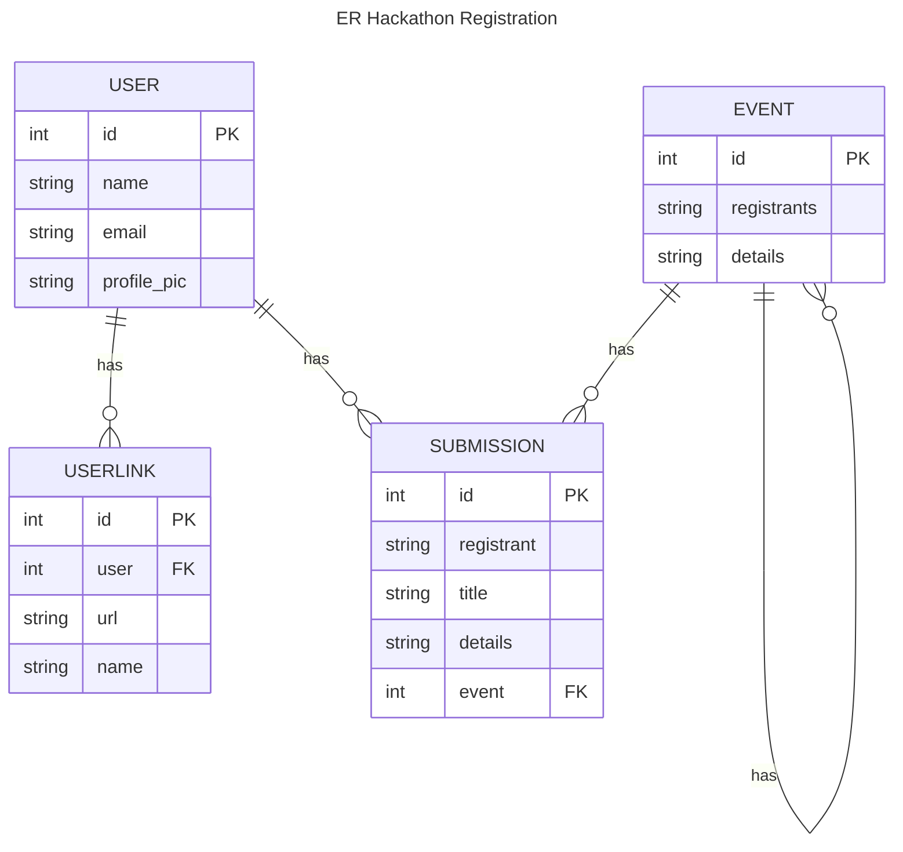

# event-register

## Pages
 - Home/Landing Page
   - List out all events & hackantons participants
 - Login/Resgistration
 - User Profile
 - User Account
 - Participants page
   - Searchable page
 - Registration page
 - CREATE, UPDATE and DELETE pages